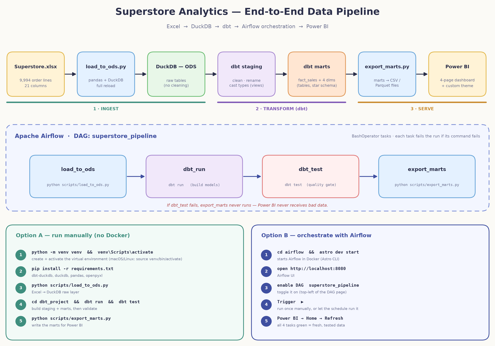
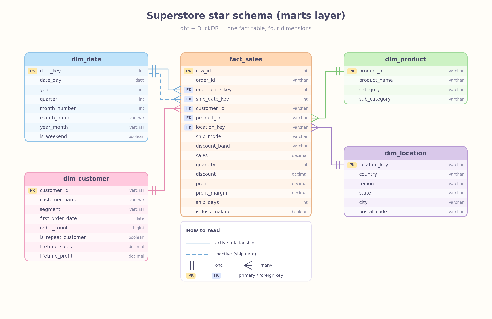
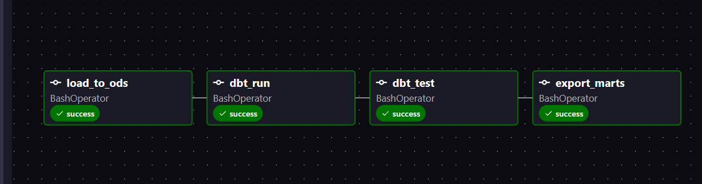
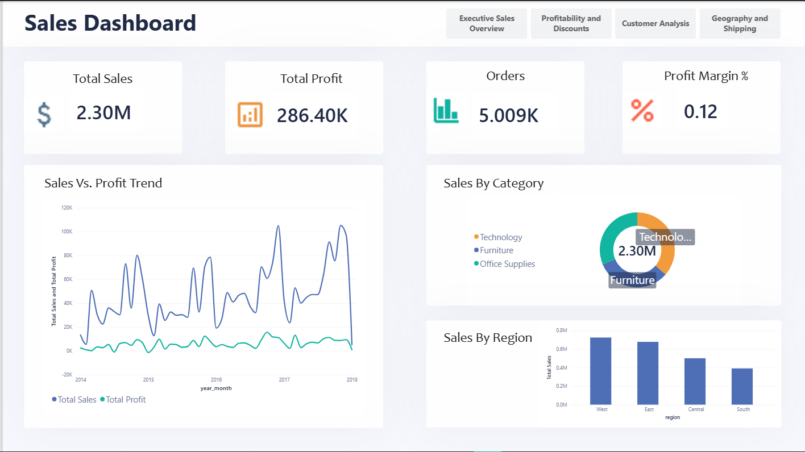
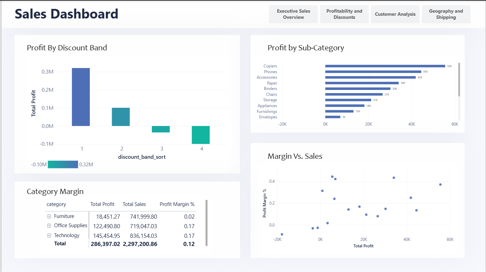
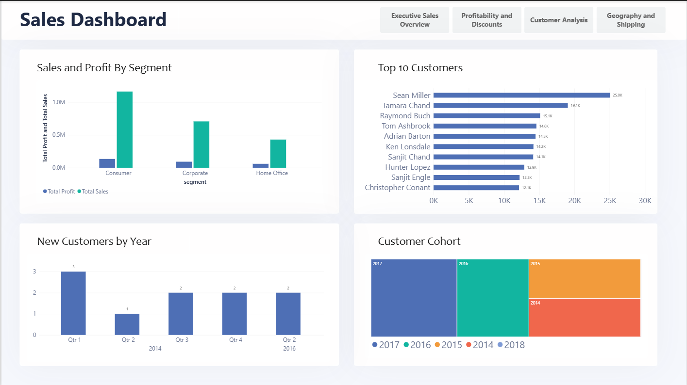
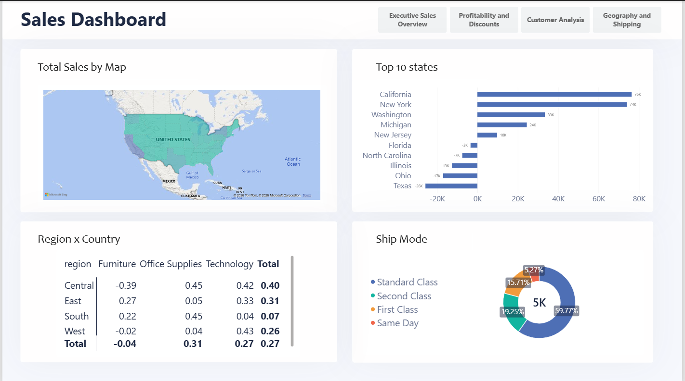

# Superstore Sales Analytics — End-to-End Data Engineering Project

An end-to-end analytics pipeline built on the classic **Superstore** dataset. Raw Excel data is loaded into **DuckDB**, cleaned and modeled into a star schema with **dbt**, orchestrated by **Apache Airflow**, and served to a 4-page **Power BI** dashboard.

| Layer | Tool | Purpose |
|---|---|---|
| Storage | DuckDB | Local analytical database (single `.duckdb` file) |
| Transformation | dbt (dbt-duckdb) | Staging models, marts (star schema), tests |
| Orchestration | Apache Airflow | Runs the pipeline in order and stops on failure |
| Visualization | Power BI | Dashboard, custom theme and DAX measures |

---

## 1. Architecture



**How the data flows**

1. **`Superstore.xlsx`** is the single source: 9,994 order lines, 21 columns.
2. **`scripts/load_to_ods.py`** reads the Excel file and writes it, untouched, into the DuckDB **ODS** (raw) layer.
3. **dbt staging** models clean the raw data: rename columns, cast data types, fix known issues.
4. **dbt marts** build the final star schema (`fact_sales` and four dimensions) that the dashboard reads.
5. **`dbt test`** validates the models. If any test fails, the pipeline stops here.
6. **`scripts/export_marts.py`** exports the marts so Power BI can read them.
7. **Power BI** loads the exported tables and renders the dashboard.

---

## 2. Project Structure


| Path | What it contains |
|---|---|
| `airflow/` | Airflow project and the `superstore_pipeline` DAG |
| `data/` | Source Excel file and exported mart files |
| `dbt_project/` | dbt models (staging, marts), tests and configuration |
| `Power-BI/dashboard/` | The Power BI report file |
| `Power-BI/DAX/` | DAX measures used by the report |
| `Power-BI/theme/` | Custom JSON theme for consistent styling |
| `scripts/load_to_ods.py` | Excel → DuckDB (raw layer) |
| `scripts/export_marts.py` | DuckDB marts → files for Power BI |
| `.env` / `.env.example` | Environment settings (copy the example to create your own `.env`) |
| `logs/` | Pipeline and dbt logs |

---

## 3. Data Model (Star Schema)



One fact table at **order-line grain** (one row per product on an order) surrounded by four dimensions.

| Table | Grain | Key columns |
|---|---|---|
| `fact_sales` | One row per order line | `row_id` (PK), `order_date_key`, `ship_date_key`, `customer_id`, `product_id`, `location_key`, `sales`, `quantity`, `discount`, `profit`, `profit_margin`, `ship_days`, `is_loss_making`, `discount_band`, `ship_mode` |
| `dim_date` | One row per day | `date_key`, `year`, `quarter`, `month_number`, `month_name`, `year_month`, `is_weekend` |
| `dim_customer` | One row per customer | `customer_id`, `segment`, `first_order_date`, `order_count`, `is_repeat_customer`, `lifetime_sales`, `lifetime_profit` |
| `dim_product` | One row per product | `product_id`, `product_name`, `category`, `sub_category` |
| `dim_location` | One row per ship-to location | `location_key`, `country`, `region`, `state`, `city`, `postal_code` |

**Date role-playing:** `fact_sales` has two links to `dim_date`. The **order date** relationship is active; the **ship date** relationship is inactive (dashed line) and is activated in DAX with `USERELATIONSHIP` when needed.

---

## 4. Dataset Notes

Findings from profiling `Superstore.xlsx`:

- **Size and range:** 9,994 order lines, 5,009 orders, 793 customers, 1,862 product IDs, orders from 2014-01-03 to 2017-12-30. All sales are in the United States.
- **Postal codes lost leading zeros** (449 rows in New England and New Jersey) because Excel stored them as numbers. They need to be padded back to 5 digits.
- **32 product IDs have more than one product name** (for example `FUR-CH-10001146`), so a canonical name must be chosen when building the product dimension.
- **8 order/product combinations appear on two lines** with different quantities. They are real separate lines, so `row_id` (not `order_id` + `product_id`) is the unique key.
- **About 18.7% of order lines are loss-making**, concentrated at high discounts.
- **No nulls, no full-row duplicates, and no ship date earlier than its order date.**

---

## 5. Orchestration (Airflow)

The DAG **`superstore_pipeline`** has four sequential `BashOperator` tasks:



| Task | Command | What it does |
|---|---|---|
| `load_to_ods` | `python scripts/load_to_ods.py` | Loads the Excel file into DuckDB |
| `dbt_run` | `dbt run` | Builds staging models and marts |
| `dbt_test` | `dbt test` | Runs data quality tests (the quality gate) |
| `export_marts` | `python scripts/export_marts.py` | Exports the marts for Power BI |

Each task depends on the previous one, so **a failure stops everything downstream**. For example, if `dbt_test` fails, `export_marts` never runs and Power BI keeps the last good data.

---

## 6. Prerequisites

- **Python 3.10+** and `pip`
- **Docker Desktop** and the **Astro CLI** (only for the Airflow option)
- **Power BI Desktop** (Windows)
- Git (optional)

---

## 7. Setup

```bash
# 1. Clone the project and enter it
git clone <your-repo-url>
cd Super_Store_Analysis

# 2. Create and activate a virtual environment
python -m venv venv
venv\Scripts\activate            # Windows
# source venv/bin/activate       # macOS / Linux

# 3. Install dependencies
pip install -r requirements.txt

# 4. Create your environment file
copy .env.example .env           # Windows
# cp .env.example .env           # macOS / Linux
```

---

## 8. Running the Pipeline

### Option A — Manually (no Docker)

Run from the project root:

```bash
# 1. Load Excel -> DuckDB (raw layer)
python scripts/load_to_ods.py

# 2. Build and test the dbt models
cd dbt_project
dbt run
dbt test
cd ..

# 3. Export the marts for Power BI
python scripts/export_marts.py
```

### Option B — With Airflow

```bash
cd airflow
astro dev start
```

1. Open **http://localhost:8080**.
2. Find **`superstore_pipeline`** and switch it on.
3. Click **Trigger** to run it.
4. Wait until all four tasks are green.

Stop Airflow with `astro dev stop`.

---

## 9. Connecting Power BI

**Recommended: load the exported files** (no driver needed)

1. Run the pipeline so `export_marts.py` creates the mart files.
2. Open the report in `Power-BI/dashboard/`.
3. If prompted, update the data source path: **Home → Transform data → Data source settings** and point it to the export folder.
4. Click **Refresh**.

**Applying the theme:** *View → Themes → Browse for themes* and select the JSON file in `Power-BI/theme/`.

**Alternative: connect directly to DuckDB** using the DuckDB ODBC driver. Be aware that DuckDB allows only one writer at a time, so close Power BI's connection before running the pipeline.

After loading, check the relationships match the star schema in section 3.

---

## 10. Dashboard

The dashboard has four pages with navigation buttons at the top.

### Executive Sales Overview


KPI cards for **Total Sales (2.30M)**, **Total Profit (286.40K)**, **Orders (5,009)** and **Profit Margin (~12%)**, plus the monthly sales vs. profit trend, sales by category and sales by region.

### Profitability and Discounts


Profit by discount band, profit by sub-category, category margin table and a margin vs. profit scatter.

### Customer Analysis


Sales and profit by segment, top 10 customers, new customers over time and a customer cohort treemap.

### Geography and Shipping


Sales map, top and bottom states by profit, margin by region and category, and ship mode share.

---

## 11. Key Business Insights

- **Furniture is barely profitable.** It earns about a 2% margin versus roughly 17% for Office Supplies and Technology.
- **Discounts above ~20% destroy profit.** The two highest discount bands are loss-making, while the no-discount and low-discount bands produce most of the profit.
- **Profit is geographically uneven.** California and New York lead, while Texas, Ohio, Illinois and North Carolina lose money.
- **Central region Furniture is the weakest cell** in the region × category matrix, with a margin of about -39%.
- **Standard Class carries about 60% of orders**, followed by Second Class and First Class.
- **Sales are seasonal**, with clear peaks in the autumn months each year.

---

## 12. Troubleshooting

| Problem | Fix |
|---|---|
| `database is locked` / IO error from DuckDB | Another program (Power BI, DBeaver, a notebook) holds the `.duckdb` file. Close it and rerun. |
| `dbt: command not found` | Activate the virtual environment first. |
| `dbt_test` fails in Airflow | Open the task log, fix the failing model or data, then clear the task to retry. |
| Airflow won't start | Make sure Docker Desktop is running and port 8080 is free. |
| Power BI shows old data | Rerun the pipeline, then click **Refresh**. |

---

## 13. Possible Improvements

- Schedule the DAG (for example daily) and add failure alerts by email or Slack.
- Add dbt `source freshness` and `accepted_values` tests.
- Add incremental models if the data grows.
- Add CI (GitHub Actions) to run `dbt build` on every pull request.
